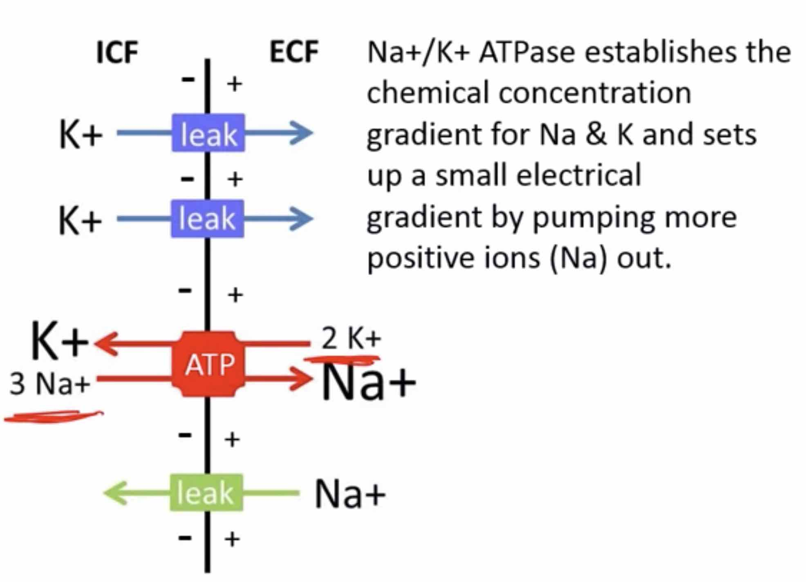
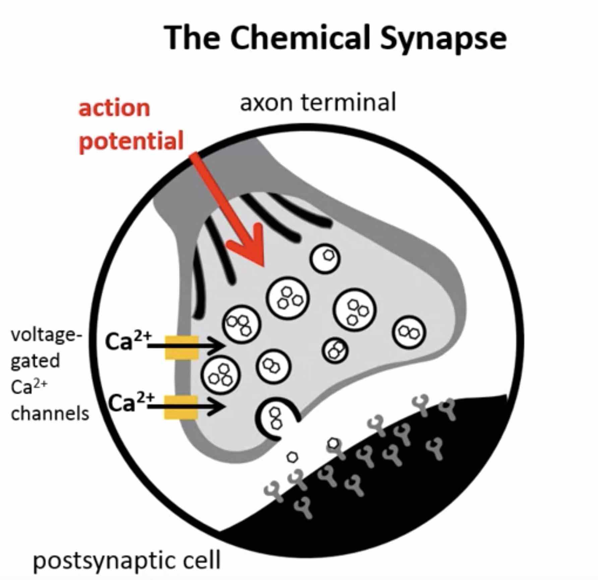

# Health Cheat Sheet

### Table of Contents

- [Physiology](#physiology)
  - [Homeostasis](#homeostasis)
  - [The Nervous System](#the-nervous-system)
- [Mediators](#mediators)
- [Nutrition](#nutrition)
- [Immune System](#immune-system)

## Physiology

The physiology in general is an integrative science that deals with complex living organisms, from 
molecules and cells to organs and organ systems level. 

The physiologist is going to ask two questions:
- How does the organ and the organ system work? 
- What's the advantage that this organ system provides to the body?

### Homeostasis

- Differentiated cell - specialized function.
- Tissue - group of cells with related function: muscle, nervous, connective, epithelium. 
- Organ - functional unit.
- Organ system - several organs act together to perform specific function:
  - Skin - barrier
  - Entry - respiratory & GI
  - Transport - CV & diffusion
  - Exit - renal & GI

**Fluid compartments**:

- Body Weight = 70kg
  - Total Body Water (TBW): 60% = 42kg 
    - Inter-Cellular Fluid (**ICF**): 66.6% = 28kg (cytoplasm)
      high Potassium (K), low Sodium (Na). 
    - Extra-Cellular Fluid (**ECF**): 33.3% = 14kg (surrounds cells, is an interface with external environment) 
      high Sodium (Na), low Potassium (K). 
      - Interstitial fluid (**IS**): 75% = 10.5kg (outside blood vessels)
      - Intravascular fluid (**IV**): 25% = 3.5kg (inside blood vessels)
      
**Equilibrium between IS and IV**:
- No net transfer of substance or energy
- No barrier to movement
- No energy expenditure to maintain

**Steady state between ICF and ECF**:
- Input = Output
- Requires energy to maintain

**Homeostasis** - the tendency toward a relatively stable equilibrium between interdependent elements, 
especially as maintained by physiological processes.

Stability of internal variables is achieved by balancing inputs and outputs to the body and among organ systems.

**5 Types of Homeostatic control**:
- **Local** response: occurs at target cell, e.g. 
  - a neighboring cell sends a chemical that reached another cell. 
  - gap junction (nexus) e.g. calcium flow in heart muscles that enables synchronous contraction and relaxation.
- **Reflexes**: response made at a distance from target cell (Body uses reflex loops to maintain homeostasis: sensors send 
signals to the brain where there are **set points** for different parameters, if the value from the sensor is below or 
above a set point it sends a signal to restore the parameter (similar to temperature control in a room)).
  - **Endocrine response** (hormones are released into blood).
  - **Neural response**.
- **Tonic** control:
  - Smooth muscles of blood vessels can constrict or dilate them to increase/decrease blood pressure, which is needed
  to maintain homeostasis in some situations.
- **Antagonistic** control:
  - Sympathetic and parasympathetic nervous systems can increase/decrease heart rate.
- **Circadian** rhythms (affected by sleep/wake cycles):
  - Growth hormone release during early sleep, falls when we are waking up.
  - Cortisol increases just before you wake up.
  - Body temperature decreases when we sleep. 
    
**Transporters, Pumps and Channels**:

- Movement of a solute across the lipid bilayer (cell membrane) is dependent on its size, charge, and solubility.
- Net flux (movement) of a solute is determined by gradients. 
- A permeable solute crosses the membrane by simple diffusion (slow), moving down its concentration gradient.
- A non-permeable solute crosses the membrane by facilitated diffusion (fast) using transporters. This process requires
a gradient, is saturable, and is specific.
- Primary active transport moves a solute against its concentration gradient. This mechanism requires energy (ATP).
- Secondary active transport couples the activity of a co-transporter with a pump. This is used for transcellular 
transport of a solute.

**Solute and Water Transport**:

- Aquaporin - transporter that allows the movement of water across cell membrane.
- Osmolarity - number of molecules per volume.
- Tonicity - tonicity is the relative concentration of solutes dissolved in solution which determine the direction 
and extent of diffusion. Accounts for number of non-penetrating molecules per volume.

- When you inject isotonic (same concentration of non-penetrating molecules per liter) into the blood, 
ECF volume increases, ICF volume doesn't change, total body water increase.
- When you lose isotonic fluid during diarrhea, ECF volume decreases, ICF volume doesn't change,
total body water decreases.
- When you eat a lot of salty food, ECF volume increases, ICF volume decreases, total body water stays the same.
- When you sweat (hypotonic loss, only water is lost), ECF volume decreases, ICF volume decreases, total body water 
decreases.

### The Nervous System

Cell Types:
- Neurons (has dendrites, from which signals are coming to the neuron, and axon, through which signal is send away to 
other neurons) 
- Glial cells - provide structural and metabolic support for neurons (e.g. insulate the neurons)
                                                                                               
**Membrane potential**:

- ATPase moves 2 Potassium (K) ions inside the cell and 3 Sodium (Na) ions outside the cell. 
- In addition, Potassium leak channels allow greater movement of Potassium, comparing to 
Sodium through the Sodium leak channels.
- These factors create net negative potential on the cell membrane.
- Nerotransmitters open Na or K channels on the membrane, which cause inflow of Na inside the cell and depolarization
(potential becomes positive) or repolarization (back to negative) of the cell.

**Action potential**:

- Voltage-gated channels on the membrane are open to Na and K when a certain potential threshold is reached. Na channels
open before K channels. The potential thus propagates through axon which is called action potential.

- Graded potential is integrated via dendrites on the body, if the sum of potential reaches the threshold on the 
initial segment it gets propagated through the axon.

- When the Action Potential reaches the axon terminal, voltage-gated Calcium channels are open and allow Calcium to go 
inside the terminal, make vesicles with neurotransmitter to fuse with the membrane and release the neurotransmitter
into the synaptic cleft.

**Types of synapses**:
- **Cholinergic**
  - **Nicotinic** (skeletal muscle, brain).
  - **Muscarinic** (heart, smooth muscle, glands, brain).
- **Adrenergic** - bind epinephrine and norepinephrine (heart, smooth muscle, glands)

**Nervous System Organization**

The nervous system is composed of the brain, spinal cord, cranial nerves (emerge directly from the brain) and 
spinal nerves.

**The Senses**

- **Somatosensation** 
  - Pain is detected by receptors in skin, muscle and bones and visceral (in organs) receptors. **nerves detecting 
  chemicals released by damaged cells and immune cells**. 
  - Temperature. **thermoreceptors** (ion channels activated at certain temperatures) 
  - Touch, pressure. **mechanoreceptors**.
  - Proprioception (joint capsule, tendon, and muscle stretch). **mechanoreceptors**.
- **Special senses** (receptors confined to a specific organ and are associated with cranial nerves)
  - **Vision** - detects the shape and color of objects and the movement of objects int he environment. Light is detected
  by different cells (rods - more sensitive to light as there are more of them, cones (blue, red, green cones)) 
  in the eye and sent via the optic nerve to the visual cortex for processing.
  - **Hearing** - sound waves are detected by eardrum, connected via middle ear (3 bones) to cochlea via oval window, where
  there is fluid. Vibraion in fluid is detected by hair cells which cause action potentail in nerve fibers. Frequency
  is determined by which area of cochlea vibrates most. Volume is detected by aplitude of hair vibration.      
  - **Vestibular System (Equilibrium)** - located near to inner ear (cochlea), 3 perpendicular hemicircle tubes. Detects
  the position and the motion of the head in space. 
  - Chemical Senses
    - **Taste** - taste buds are located in the tongue. Chemicals dissolved in liquid are detected by taste receptor 
    cells located in taste buds. 5 basic tastes (umami, salt, sugar, sour, bitter) correspond to 5 chemicals the taste
    cells detect (glutamate, sodium (Na+), glucose, hydrogen ions (H+), plant alkaloids)
    - **Smell** - results from the activation of olfactory receptors (~400) in the nose. We can discriminate ~10,000 odors
    as combination of 400 receptors.
- Visceral stimuli (pH, O2 content of blood, osmolarity, blood glucose.

**Sensation** - sensory information that reaches the brain
- what stimulus is (each nerve fiber is responsible only for 1 type of stimulus)
- where it is
- how strong (determined by action potential frequency)

**Perception** - how we interpret the sensation 

**Somatic Nervous System** controls locomotion, fine movements, body posture, and equilibrium by acting on motor
neurons in the spinal cord that innervate the skeletal muscles.

A motor neuron and the muscle fibers that it innervates constitute a **motor unit**.

Motor neurons have cell bodies located in grey matter of the ventral horn of the spinal cord. The spinal cord contains
interneurons which play a role in coordinating the responses of antagonistic and synergistic muscles to carry out
intended movements as well as reflexive movements initiated by sensory receptors.

**Muscle Stretch Reflex (knee jerk reflex)** - when the rubber hammer is striking the patellar tendon under the knee cap
it's tugging on the quadricep muscle. The afferent neuron coiled around the muscle spindle sense stretch (
muscle length and speed of stretch). It acts in reciprocal innervation causing contraction of stretched muscle and
relaxation of antagonistic muscle.

Walking movements are initiated by central pattern generators in the spinal cord. Interneurons coordinately drive 
antagonistic muscles in withdrawal and crossed-extensor reflexes and can be modified by sensory feedback. 
                                                                                            
## Mediators

### GABA and Glutamate: Yin and Yang of the Brain

**[GABA (gamma-Aminobutyric acid)](https://en.wikipedia.org/wiki/Gamma-Aminobutyric_acid)** 
is the chief **inhibitory** neurotransmitter in the central nervous system.
Low GABA levels are associated with restlessness, anxiety, insomnia and a poor mood state.

**[Glutamate](https://en.wikipedia.org/wiki/Glutamate_(neurotransmitter))** 
is the chief **excitatory** neurotransmitter in the central nervous system.

### Serotonin

**Serotonin** or 5-hydroxytryptamine (5-HT) is both a mediator and a hormone. First it was discovered in vessel walls,
where it causes constriction (thus the name). 

Serotonin functions:

- Inhibitory/calming function. Induces sleep.
- Reduces pain sensitivity. 
- Inhibits weak neural signals in the brain (helps GABA). Helps to focus on the main task.
- Inhibits negative emotions.

[Increasing Serotonin without drugs](https://www.ncbi.nlm.nih.gov/pmc/articles/PMC2077351/) (there is no direct proof
the methods described below work):

- Positive mood inductions.
- Exposure to bright light. [Lux](https://en.wikipedia.org/wiki/Lux). Intensity of light inside a room (320 - 500 lux)
is 20 times lower than the intensity of light outside at full daylight (10,000 - 25,000 lux).
- Exercise.
- Diet - foods with high tryptophan content may increase serotonin in the brain (chickpeas, hummus).

A video about Serotonin from a Russian professor (in Russian): 
https://www.youtube.com/watch?v=oJDATLKNoOY&list=PLuXVSZY9-G53pzp4lboV3DdDslVcwrriJ

### Dopamine

https://www.ncbi.nlm.nih.gov/pubmed/11958969

## Nutrition

### The 5 basic tastes

The 5 basic tastes help us identify nutrients in the food that are important for our body:

- **Sweet** - sugar, source of energy.
- **Salty** - salt, important for maintaining ion balance - potassium/sodium.
- **Sour** - acid, important for maintaining pH balance.
- **Bitter** - many bitter compounds are bitter and toxic. 
    Some antioxidants are bitter and healthy e.g. chocolate, coffee.
- **Umami** - glutamate, contained in protein food, source of building material for cells in our body.

## Immune System

There are 2 types of immune system:

- Innate - works within minutes/hours.
    - Lysozyme (muramidase) - antimicrobial enzyme. Destroys membrane of bacteria. Contained in saliva, tears, human 
    milk, mucus, egg whites. 
    - Interferon (IFNs) - produced by cells in response to viruses.
    - The complement system - consists of a number of small proteins that are synthesized by the liver, and circulate in
    the blood as inactive precursors. When stimulated by one of several triggers, proteases in the system cleave 
    specific proteins to release cytokines and initiate an amplifying cascade of further cleavages.   
    - Granulocyte - a category of white blood cells (WBCs, aka leukocytes) characterized by the presence of granules in 
    their cytoplasm.
    - Macrophage - a category of white blood cells, that engulfs and digests cellular debris, foreign substances, 
    microbes, cancer cells, and anything else that does not have the type of proteins specific to healthy body cells 
    on its surface in a process called phagocytosis.
    - Natural killer cell - are a type of cytotoxic lymphocyte, provide rapid responses to virus-infected cells, 
    acting at around 3 days after infection, and respond to tumor formation. 
- **Adaptive** - works within days/weeks.
    - **Antibodies** (aka immunoglobulin (**Ig**)) - Y-shaped protein produced mainly by plasma cells that is used by the 
    immune system to neutralize pathogens such as pathogenic bacteria and viruses. Tags that are attached to antigens.
        - ~100MLN of types of antibody binding sites (paratopes). Determined by random combination of fragments in 
        5 positions (3 for long chain, 2 for short chain) in each binding site. Much smaller amount of genes are needed
        to encode the fragments, which are then randomly combined when immune cells are generated.
        - 5 types of antibody handles: IgA, gD, IgE, IgG, IgM
    - **B lymphocyte** (B-cells) - secrete antibodies.
    - **T lymphocyte** (T-cells) - there are a few subtypes: 
        - T-helpers type 1 - activate macrophages.
        - T-helpers type 2 - interact with B-cells.
        - T-killers - kills cells infected with viruses.
    
Adaptive immune system detects antigens using antibodies, produces more antibodies, which are attached to antigens as
tags, then those tags are detected by innate immune system cells phagocytes and destroyed.  

After the first infection it may take 14 days for the adaptive immune system to produce the sufficient amount of 
antibodies. After that the immune system learns, the body already has a lot of B lymphocytes for the seen antigen.
For subsequent infection the immune system will take 1 - 2 days to produce the sufficient amount of antibodies.    
    

All blood cells are differentiated from stem cells produced in bone marrow.

**Blood cell types**:

- **Red blood cells** (erythrocytes) - the cells that deliver oxygen to the body tissues.
- **White blood cells** (leukocytes) - the cells of the immune system.
    - Lymphocytes - white blood cells of adaptive immune system.
    - Phagocytes - white blood cells of innate immune system.
- **Platelets** (thrombocytes) - the cells that react to bleeding from blood vessel injury by clumping, 
thereby initiating a blood clot. 

The basics of immune system in Russian: https://www.youtube.com/watch?v=tJXk2zDomWk

## The Science of Well Being

Biases of our brain that affect how happy we are:

- We don't think in terms of absolutes, we constantly compare ourselves to reference points, we don't have control
over what those reference points are. In other words we compare ourselves to people around us or 
who we see on TV/Facebook.
- Our minds are built to get used to stuff. We become less happy from things that made us more happy before.
- We don't realize that our minds are built to get used to stuff.
 
Strategies to counteract our bias of getting used to stuff:
 
- **Savoring** - the act of stepping outside of an experience to review and appreciate it (sharing good experiences
with others, showing physical expressions of energy, telling yourself how proud you are)  
- **Negative visualization** - thinking about the reverse that could have happened (couples wrote for 15 minutes about
how they might never had met their partner) 
- **Make this day your last** - thinking about having something for the last day, e.g. spending your last day at 
University.  
- **Gratitude** - the quality of being thankful and a tendency to show appreciation for what one has.

Strategies to counteract our bias of comparing ourselves to reference points:

- **Concretely re-experience** - go back and re-experience what your old reference point was before, e.g. remember your 
first day at your job that you like more than the previous job.
- **Concretely observe** - compare yourself to worse reference points.
- **Avoid social comparisons** - delete Facebook, Twitter, Youtube apps from your phone.
- **Interrupt your consumption** - e.g. if you're listening to music, make an interruption for some time and then return 
to it.
- **Increase your variety** - e.g. eat different kinds of ice-cream instead of same one. 

Right things to want:

- Don't look for a job with high pay, instead look for a job where you can utilize your signature strengths, achieve
flow.
- Kindness increases happiness. One study shows that spending money on someone else rather than yourself increases
happiness.  
- Social connections make us happier. One study shows that talking to strangers on a metro train makes both
 parties happier.
- Time affluence - people who prioritize time over money are happier.
- Mind wandering (when you default network is active) makes people unhappy. **Meditation** is the practice of
turning your attention away from distracting thoughts toward a single point of reference (e.g. the breath, 
bodily sensations, compassion, a specific thought, etc.)
- Exercise, sleep makes you happier.

WOOP (Wish, Outcome, Obstacle, Plan) - aka MCII (mental contrasting with implementation intentions).

Coursera course: https://www.coursera.org/learn/the-science-of-well-being

## Misc

Sauna increases growth hormone in the blood https://www.ncbi.nlm.nih.gov/pubmed/3218898

Klotho is an enzyme that in humans is encoded by the KL gene. 
It appears to be involved in ageing. 
Exercise seems to play a key role on expression of the Clotho gene https://www.ncbi.nlm.nih.gov/pubmed/29962352

# Resources

- The Science of Well-Being Coursera course: https://www.coursera.org/learn/the-science-of-well-being
- The basics of immune system in Russian: https://www.youtube.com/watch?v=tJXk2zDomWk
